# D_diagrama_asis.md

## Diagrama AS-IS — Consulta processual pública no e-Proc/JMU por cidadão interessado

Perspectiva do **cidadão externo não autenticado**. Diagrama relacional derivado do `C_blueprint_asis.md`: as setas tornam visíveis os handoffs entre frontstage, backstage síncrono, backstage assíncrono e a camada de suporte, além dos pontos de falha (⚠) e do gate jurídico de publicidade/sigilo.

```mermaid
flowchart LR
  C(["Cidadão não autenticado"])

  subgraph JORNADA["Frontstage + Linha de Interação"]
    direction LR
    E0["E0 · Pré-sistema<br/>Identifica necessidade e verifica posse do número"]
    D0{"Possui o número<br/>do processo?"}
    E1["E1 · Acesso ao portal<br/>e descoberta da consulta<br/>EV1, EV2"]
    D1{"Localiza a<br/>consulta pública?"}
    E2["E2 · Escolha do ambiente<br/>1º grau / Auditorias ou 2º grau / STM<br/>EV3"]
    D2{"Ambiente<br/>correto?"}
    E3["E3 · Preenchimento<br/>Número do processo · EV3, EV4"]
    E4["E4 · Validação / segurança antiabuso<br/>EV4, EV5"]
    D4{"Validação da<br/>requisição OK?"}
  end

  C --> E0 --> D0
  D0 -->|"Não"| FPnum
  D0 -->|"Sim"| E1 --> D1
  D1 -->|"Não"| FP1
  D1 -->|"Sim"| E2 --> D2
  D2 -->|"Não"| FPinst
  D2 -->|"Sim"| E3 --> E4 --> D4
  D4 -->|"Não · erro de validação"| FP3
  D4 -->|"Sim"| E5

  subgraph SINC["Backstage Síncrono"]
    direction LR
    E5["E5 · Processamento automático<br/>Consulta à base / indexadores"]
    GATE{"Gate de publicidade / sigilo<br/>CF 93 IX · CNJ 121/2010 · LAI · LGPD"}
  end

  E5 --> GATE
  GATE -->|"Público permitido + dado existe"| R1
  GATE -->|"Sem correspondência"| R2
  GATE -->|"Restrição normativa"| R3
  E5 -->|"Falha técnica / timeout"| R4

  subgraph RAMOS["E6 · Ramos de saída da consulta"]
    direction TB
    R1["Resultado encontrado<br/>EV6, EV7, EV8"]
    R2["Processo não encontrado<br/>EV9"]
    R3["Acesso restrito / sigilo /<br/>publicidade mitigada · EV9"]
    R4["Erro operacional /<br/>indisponibilidade / timeout · EV9, EV10"]
  end

  R1 --> E7["E7 · Interpretação / compreensão<br/>Metadados e movimentações · EV7, EV8"]
  D7{"Compreende a<br/>informação?"}
  E7 --> D7
  D7 -->|"Sim"| FIM(["Encerramento<br/>Informação obtida e compreendida"])
  D7 -->|"Não"| FP6

  R2 --> FP4
  R3 --> FP4
  R4 --> FP4

  %% Fail points
  FPnum["⚠ FP-num<br/>Sem número adequado → bloqueio pré-sistema"]
  FP1["⚠ FP1<br/>Descoberta insuficiente do serviço"]
  FPinst["⚠ FP-inst<br/>Escolha incorreta do ambiente"]
  FP2["⚠ FP2<br/>Parâmetro inadequado"]
  FP3["⚠ FP3<br/>Barreira de validação / acessibilidade"]
  FP4["⚠ FP4<br/>Ambiguidade semântica das respostas"]
  FP5["⚠ FP5<br/>Timeout / degradação de desempenho"]
  FP6["⚠ FP6<br/>Opacidade cognitiva · linguagem jurídica"]

  E3 -.-> FP2
  FP2 -.->|"Falso negativo"| R2
  FPinst -.->|"Falso negativo"| R2
  E5 -.-> FP5
  FP5 -.-> R4

  %% Saídas / transbordo
  FP1 --> TRANSB
  FP4 --> TRANSB
  FP6 --> TRANSB
  FPnum --> ABANDONO
  FP3 --> ABANDONO

  TRANSB["Transbordo · Saída da jornada<br/>Suporte / ouvidoria"]
  ABANDONO(["Abandono da jornada"])

  subgraph SUP["Suporte / Infraestrutura / Governança"]
    direction TB
    GOV["Governança de dados e segurança<br/>Define controles de publicidade e minimização"]
    TI["TI / Infraestrutura<br/>Disponibilidade e desempenho"]
    OUV(["Ouvidoria / atendimento humano"])
  end

  subgraph ASINC["Backstage Assíncrono — produção anterior do dado"]
    direction TB
    ASYNC["Secretarias · Auditorias 1º grau e STM 2º grau<br/>Autuação, classificação, movimentações,<br/>metadados e flags de sigilo / publicidade"]
  end

  TRANSB --> OUV
  GOV -.->|"Alimenta o gate"| GATE
  TI -.->|"Sustenta"| E5
  ASYNC -.->|"FP7 · qualidade do dado de origem"| E5
  ASYNC -.-> R1

  classDef fp fill:#ffe0e0,stroke:#cc0000,color:#000;
  classDef gate fill:#fff3cd,stroke:#d39e00,color:#000;
  classDef exitNode fill:#e0e7ff,stroke:#3b49df,color:#000;
  classDef done fill:#e0ffe0,stroke:#2e7d32,color:#000;

  class FPnum,FP1,FPinst,FP2,FP3,FP4,FP5,FP6 fp;
  class GATE gate;
  class TRANSB,OUV,ABANDONO exitNode;
  class FIM done;
```

## Observações analíticas

- **Derivação direta da Parte C:** cada nó corresponde a uma etapa (E0–E8), ramo ou fail point já fixado no `C_blueprint_asis.md`; o diagrama apenas explicita, com setas, as relações que na tabela ficavam implícitas por coluna.
- **Handoffs visíveis:** a linha de visibilidade aparece na transição `E5 → GATE` (frontstage para backstage síncrono); a linha de interação interna aparece nas setas pontilhadas que ligam o **backstage assíncrono** (`ASYNC`) e a **governança** (`GOV`) ao processamento e ao gate.
- **Gate jurídico como decisão de fluxo:** o `GATE` de publicidade/sigilo bifurca explicitamente entre retorno público, ausência de correspondência e restrição normativa — o ramo "restrito" decorre de regra (CF 93,IX; CNJ 121/2010; LAI; LGPD), não de falha técnica; o erro operacional (R4) parte do processamento, não do gate.
- **Erro de validação ancorado em E4:** a falha de validação leva a `FP3`, separada dos quatro ramos de saída da consulta, preservando a semântica decidida no grill.
- **Fail points e FP7 transversal:** os pontos de falha estão destacados em vermelho; `FP7` aparece como aresta pontilhada do backstage assíncrono para o processamento, mostrando que a qualidade do dado de origem condiciona o que chega ao cidadão.
- **Transbordo só como saída:** ouvidoria/suporte (`OUV`) é alcançada exclusivamente via `TRANSB`, que por sua vez só recebe fluxo de fail points (FP1, FP4) ou de compreensão insuficiente (FP6) — nunca como continuação normal do serviço, conforme o recorte AS-IS.
